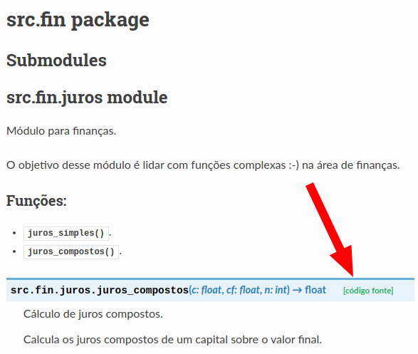
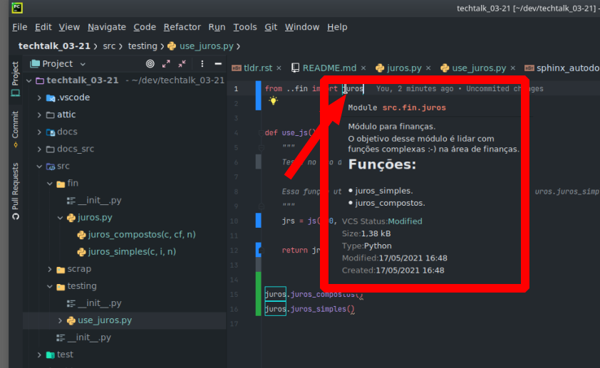
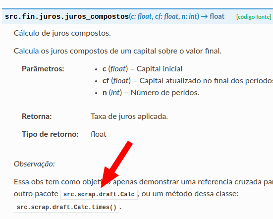

#################
Techtalks_03-21
#################

`TL;DR <https://sidon.github.io/techtalk_03-21/>`_

Descrição do projeto
=====================
Apresentação de estratégia de documentação de código de projetos no github.

O arquivo Readme:
=================
O arquivo readme deve conter uma documentação sucinta sobre o objetivo do projeto; Informações a respeito da plataforma 
utilizada e como proceder à instalação, e, eventualmente um link para a documentação nível mais alto, como regras de 
negócio, arquitetura, etc.

A documentação técnica referente a cada arquivo de código, como descrição de objetos e atributos, cross-links entre 
objetos e/ou classes pode ser armazenada no próprio repositório github em forma de html, para isso é necessario 
habilitar o `pages do projeto no github <https://sidon.github.io/techtalk_03-21/source/tldr.html#configure-docs-local-github>`_,
e então adicionar o link para essa documentação, nesse exemplo foi utilizado 
docstrings para isso:

https://sidon.github.io/techtalk_03-21/

Exemplo da documentação de um atributo com link para o codigo.

Clique na imagem para ver no site.

Os editores/IDE mais utilizados como Visual Studio Code, Pycharm, etc, podem apresentar a documentaçao de um atributo, 
quando o desenvolvedor estaciona o mouse sobre a definição do mesmo, abaixo um exemplo com o Pycharm em um codigo desse
projeto:

A Documentação feita no codigo através de docstrings, permite que novos desenvolvedores que estejam entrando para o 
contexto do projeto possam ter conhecimento dos atributos navegando no próprio código, como no exemplo acima, mas 
também permite expor essa mesma documentação mesmo para quem não tenha acesso direto ao codigo, abaixo um exemplo
da documentação de um atributo com referencia cruzada:

Docstgrings
============

Em programação, uma docstring é uma string literal especificada no código-fonte, usada como um comentário, para 
documentar um segmento específico de código.
Linguagens que suportam dosctrings incluem Python, Lisp, Elixir, Clojure, Gherkin, Julia and Haskell.

O arquivo readme deve conter uma documentação sucinta sobre o objetivo do projeto; Informações a respeito da plataforma
utilizada e como proceder à instalação, e, eventualmente um link para a documentação mais de alto nível, como regra de
negócios, arquitetura, etc.
